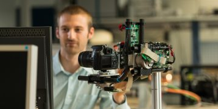
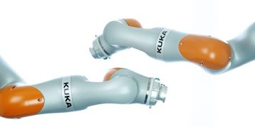
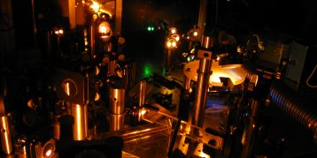

# Complex Dynamical Systems (CDS) @ TU Wien
The Complex Dynamical Systems group does research in the field of modeling, simulation, analysis, optimization and control of complex dynamical systems as well as in image processing, sensor fusion, and cognitive robotics. The primary goal of our research is the improvement of the system behavior in view of the dynamic properties, the accuracy, the robustness, the reliability, the flexibility, the productivity, the overall equipment efficiency (energy, resources) by reducing the product costs at the same time.

| **Nonlinear Systems** | **Industrial Robotics** | **Photonic and Quantum Systems** |
| :-------------------: | :---------------------: | :------------------------------: |
|  |  |  |
| The research field Nonlinear Systems is concerned with the development of methods, and the practical implementation of observer and control strategies for systems with significant nonlinear behavior. Similar to other fields of research, a focus lies on the practical implementation of the developed controller and observer strategies in a real (industrial) application. | In the research field Industrial Robotics, research is conducted on many topics related to industrial robotic systems as well as physical human-robot interaction. The considered systems range from classical industrial robots and collaborative robots to mobile robots and flying drones. Solutions are developed for a variety of different problems, ranging from novel programming and interaction concepts to algorithms for complex trajectory planning in highly redundant systems. | The research group Photonic and Quantum Systems is dedicated to improve and expand the capabilities of photonic systems on one hand and contribute towards future quantum technologies on the other hand by utilizing methods from mathematical modelling, system analysis, optimization, and control theory. |